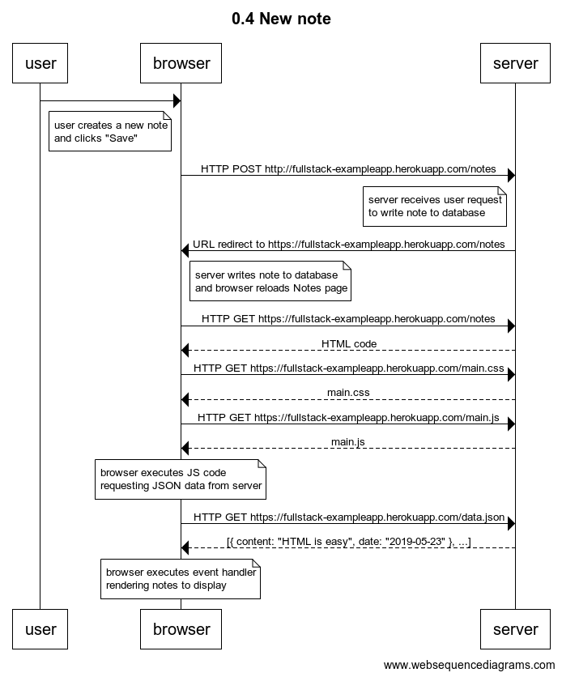
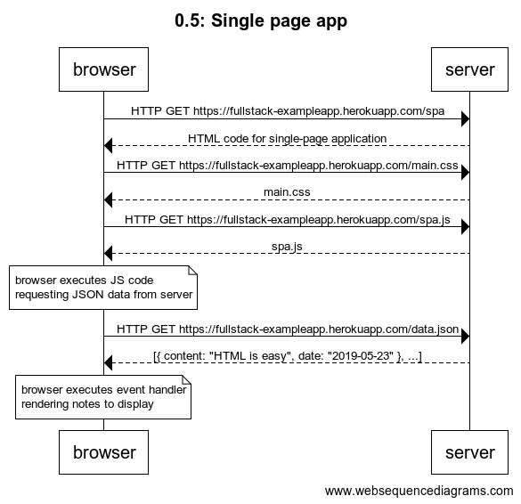
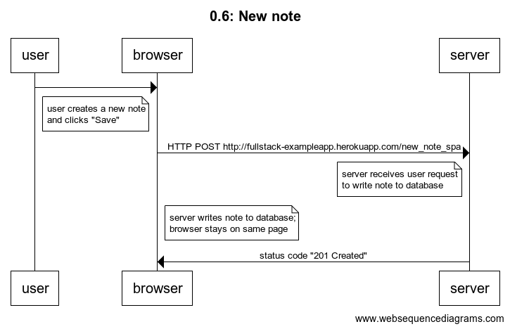

# Exercises 0.1. to 0.6

## 0.1: HTML

Review the basics of HTML by reading this tutorial from Mozilla: [HTML tutorial](https://developer.mozilla.org/en-US/docs/Learn/Getting_started_with_the_web/HTML_basics).

This exercise is not submitted to GitHub, it's enough to just read the tutorial

## 0.2: CSS

Review the basics of CSS by reading this tutorial from Mozilla: [CSS tutorial](https://developer.mozilla.org/en-US/docs/Learn/Getting_started_with_the_web/CSS_basics).

This exercise is not submitted to GitHub, it's enough to just read the tutorial

## 0.3: HTML forms

Learn about the basics of HTML forms by reading Mozilla's tutorial [Your first form](https://developer.mozilla.org/en-US/docs/Learn/Forms/Your_first_form).

This exercise is not submitted to GitHub, it's enough to just read the tutorial

## 0.4: New note

Create a diagram depicting the situation where the user creates a new note on page https://fullstack-exampleapp.herokuapp.com/notes by writing something into the text field and clicking the submit button.

## 0.5: Single page app

Create a diagram depicting the situation where the user goes to the [single page app](https://fullstackopen.com/en/part0/fundamentals_of_web_apps#single-page-app) version of the notes app at https://studies.cs.helsinki.fi/exampleapp/spa.

## 0.6: New note

Create a diagram depicting the situation where user creates a new note using the single page version of the app.

